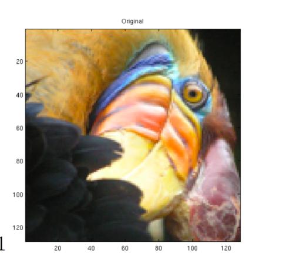
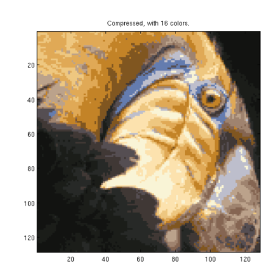

# Image_compressor

This project was developed as part of the unsupervised-learning, recommenders-reinforcement, learning offered by Stanford University on Coursera(https://www.coursera.org/). It showcases concepts such as reinforcement learning and the use of K-means to compress an image, implemented using python.

## 🚀 Project Description

The first part of the project visualizes how the K-means algorithm clusters 2D points. The second part applies K-means to an image's color data to reduce the total number of colors to `K`, resulting in a compressed image.

Key steps include:
- Random initialization of centroids
- Assignment step and centroid update
- Iterative optimization
- Mapping each pixel to the nearest centroid color

## 📷 Example Result

Original image (16 million colors) ➡ Compressed image using only 16 colors.

**Original Image:**  

**Compressed Image (K = 16):**  

## 📚 Based on

- Course: unsupervised-learning, recommenders, reinforcement-learning
- Instructor: Andrew Ng 
- Platform: [Coursera](https://www.coursera.org/)  
- Institution:  Stanford University

## 🛠️ Tools & Technologies

- Language: Python
- Libraries: NumPy, Pandas, Scikit-learn, Matplotlib
- Jupyter Notebook / Colab / Other

## ⚠️ Disclaimer

This project is a personal implementation of course concepts for learning and demonstration purposes only. It **does not** include graded solutions or any course-provided restricted content in violation of Coursera's Honor Code.

## 📄 License

This project is open-source and available under the [MIT License](LICENSE), unless otherwise specified.

